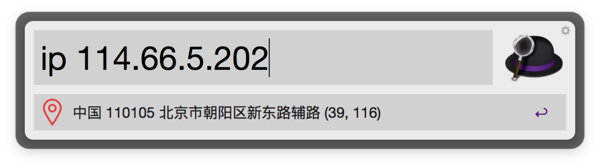
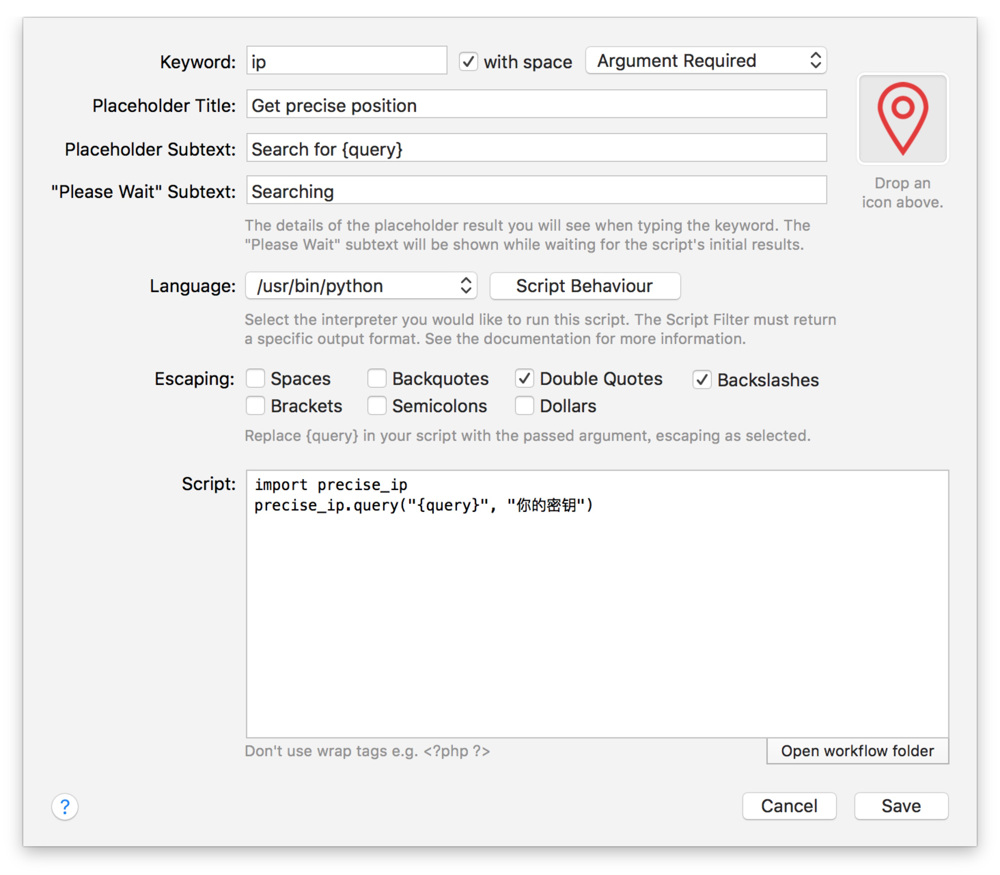

# precise-ip
Get the precise position for your ip

# alfredworkflow

* Apply for your AK (http://lbsyun.baidu.com/apiconsole/key?application=key)

* Click the download buttons below

* Double-click to import into Alfred

* Configure your AK

